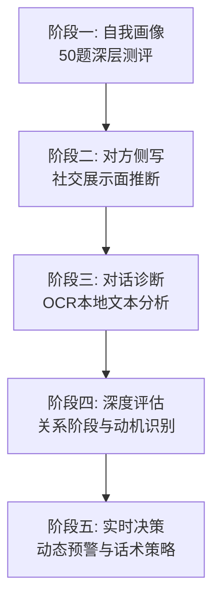

<div align="center">

# 💕 Love Advisor | 恋爱军师

**"用理性之光，照亮感性的迷雾"**

[](LICENSE)
[](https://www.python.org/)
[](https://github.com/)

**一个基于实证心理学与量化分析的开源关系诊断系统**
*看清信号，理解自己，然后勇敢地做决定*

</div>

---

## 🛠️ 我们试图解决的"熵"

在恋爱关系中，最折磨人的往往不是"拒绝"，而是**极高的不确定性**。

暧昧期的反复拉扯、沟通中的错位感知、投入与回报的失衡——这些模糊的"感觉"让决策变成了盲目的赌博。你盯着聊天记录看了三个小时，试图从标点符号里读出对方的心意；你在深夜反复计算自己发了多少条消息、对方隔了多久才回；你明明知道该止损，却总在"再等等看"里消耗自己。

**恋爱军师** 致力于将心理学研究转化为可操作、可量化的工程工具。我们把碎片的聊天记录和社交信号"脱水"，翻译成有据可依的指标，让你的每一场决定都有逻辑支撑。不是帮你算出"她一定喜欢你"，而是帮你算清"继续投入的期望收益是多少"。

---

## 📚 理论基石 (Scientific Foundation)

拒绝玄学，拒绝套路。本项目所有的分析框架均锚定于心理学顶刊及经典理论：

| 核心理论 | 解决的核心问题 | 权威度 |
|:--- |:--- |:---:|
| **成人依恋理论** (Bowlby/Ainsworth) | 识别焦虑/回避倾向，预判互动中的防御机制 | ⭐⭐⭐⭐⭐ |
| **大五人格模型 (OCEAN)** | 评估长期适配度，而非短期的性格伪装 | ⭐⭐⭐⭐⭐ |
| **Gottman 关系科学** | 识别"末日四骑士"（批评/蔑视/防御/筑墙），预判长期关系崩溃概率 | ⭐⭐⭐⭐⭐ |
| **Rusbult 投资模型** | 量化满意度与退出成本，辅助"止损"决策 | ⭐⭐⭐⭐ |
| **社会渗透理论** (Altman & Taylor) | 分析自我表露深度，判断关系推进节奏 | ⭐⭐⭐⭐ |
| **语言风格匹配 (LSM)** | 通过词频与同步率分析，测量潜意识里的亲密度 | ⭐⭐⭐⭐ |

> **[标注说明]**：系统内置知识库对每条结论均设有 `Credibility Index`（1-5星），5星为同行评审顶刊元分析，1星为生活观察，确保你清楚每条建议的可靠程度。

---

## ⚙️ 五维分析矩阵 (Process Workflow)



### 阶段一：自我画像 (Self-Profiling)

基于 **50 题交互式测评**（`resources/quiz.html`），覆盖六大维度：

- **大五人格**（开放性/尽责性/外向性/宜人性/神经质）
- **依恋类型**（安全型/焦虑型/回避型/恐惧型）
- **黑暗三角**（自恋/马基雅维利主义/精神病态倾向）
- **自尊水平**与**控制点**（内控/外控）
- **感觉寻求**与**时间取向**
- **关系修复能力**

输出结构化 JSON 报告，明确你的底层依恋模式、恋爱风格，以及**什么样的异性最适合你**——不是"温柔体贴"这种空话，而是"高尽责性+安全型依恋+中等外向性"这种可操作的画像。

### 阶段二：对方侧写 (Subject Profiling)

基于有限信息推断对方性格，信息来源包括：

| 信息类型 | 推断维度 | 示例 |
|:---|:---|:---|
| **社交媒体展示** | 外向性、神经质、自我监控水平 | 三天可见→高边界感；高频发帖→高外向性 |
| **音乐/影视偏好** | 开放性、感觉寻求、宜人性 | 爵士/古典→高开放性；恐怖片→高感觉寻求 |
| **运动/游戏习惯** | 外向性、尽责性、竞争性 | 规律健身→高尽责性；MOBA→竞争驱动 |
| **饮食/消费模式** | 感觉寻求、尽责性、神经质 | 喜辣→冒险精神；冲动消费→高神经质 |
| **聊天用语分析** | 宜人性、神经质、语言风格匹配度 | 高频"我"→高自我关注；同步你的语气→亲密度高 |

> **星座/MBTI 仅作辅助参考**，系统会明确标注其科学性局限（MBTI 信效度不理想，星座纯属巴纳姆效应），不做决策依据。

### 阶段三：对话诊断 (Interaction Metrics)

通过 **本地 OCR 工具**（`resources/chat_ocr.html` 浏览器版 或 `scripts/chat_ocr.py` 命令行版）提取聊天记录，进行 **七维评分模型 (R1-R7)**：

| 维度 | 权重(短期S) | 权重(长期L) | 核心考察点 |
|:---|:---:|:---:|:---|
| **R1 回复积极性** | 15% | 10% | 回复速度、规律性与主动性 |
| **R2 话题参与度** | 15% | 10% | 话题发起、延续与拓展意愿 |
| **R3 情感投入度** | 15% | 20% | 私人感受分享、关心程度、共情表达 |
| **R4 主动性** | 20% | 10% | 主动发起聊天的频率与质量 |
| **R5 特殊信号** | 20% | 5% | 暧昧表达、亲昵称呼、调侃撒娇 |
| **R6 一致性** | 5% | 25% | 热情度的稳定性，是否忽冷忽热 |
| **R7 投资度** | 10% | 20% | 愿意付出的时间、精力与行动 |

**关系可能性计算公式**：

```
短期发展可能性 S = R1×0.15 + R2×0.15 + R3×0.15 + R4×0.20 + R5×0.20 + R6×0.05 + R7×0.10
长期发展可能性 L = R1×0.10 + R2×0.10 + R3×0.20 + R4×0.10 + R5×0.05 + R6×0.25 + R7×0.20
```

| 分数区间 | 短期发展(S) | 长期发展(L) |
|:---:|:---|:---|
| 8-10 | 🟢 大有希望，积极推进 | 🟢 基础扎实，值得投入 |
| 6-7.9 | 🟡 有机会，需策略性推进 | 🟡 有潜力，需培养深度 |
| 4-5.9 | 🟠 信号不明，需观察 | 🟠 基础薄弱，需时间验证 |
| 2-3.9 | 🔴 信号偏冷，难度较大 | 🔴 不太乐观，慎重投入 |
| 0-1.9 | ⚫ 基本无望，建议止损 | ⚫ 缺乏基础，不建议投入 |

**调情动机识别**：不要只看行为，要看动机。系统会分析聊天中的信号属于以下哪种动机：
- **关系动机**（✅ 积极：主动自我表露、寻求深度回应）
- **探索动机**（🟡 中性：测试是否适合发展）
- **乐趣动机**（🟡 中性：单纯享受暧昧过程）
- **性动机**（🟠 需注意：以性吸引为目的）
- **自尊动机**（🔴 警示：享受关注但不愿确立，可能养鱼）
- **工具性动机**（🔴 警示：获取实际好处，利用感情）

### 阶段四：深度评估 (Deep Assessment)

在阶段三基础上，增加以下深度分析：

**关系阶段判断**：识别当前处于哪个阶段，明确下一目标
- 初识/吸引期 → 暧昧期 → 确立/蜜月期 → 权力冲突期 → 稳定/承诺期

**沟通模式分析**：
- 对方风格（直接/间接/回避/试探）
- 双方节奏匹配度
- 语言风格匹配度（LSM）：同步率越高，关系满意度越高

**话题策略建议**：
- ✅ **安全话题**：基于对方兴趣的低风险破冰话题
- ⚠️ **进阶话题**：可推进亲密度的自我表露话题
- ❌ **避免话题**：可能触发防御机制的敏感领域

**时机判断**：是否适合邀约、表白或升级关系表达

### 阶段五：实时决策 (Dynamic Warning)

成为用户的**持续顾问**，动态追踪关系变化：

**预警分级系统**：
- 🟢 **积极信号**：对方主动增加联系频率、分享私人内容、使用亲昵表达、主动制造见面机会
- 🟡 **警示信号**：回复速度变慢、话题参与度降低、语气从亲密变回礼貌、不再主动分享日常
- 🔴 **危险信号**：明确表示只想做朋友、长期忽冷忽热无进展、只在需要帮助时联系、持续焦虑内耗、出现 Gottman "四骑士"行为、对方展现不可调整的黑暗三角特质

**关键决策标准**：
- **何时表白**：S ≥ 7、对方有持续好感信号、已有足够线下互动、你能接受最坏结果
- **何时止损**：L 持续低于 3 且无上升趋势、对方明确拒绝、痛苦大于快乐、Rusbult 模型显示沉没成本陷阱、回避型依恋且拒绝修复
- **何时保持现状**：关系缓慢升温但未到关键节点、积极信号但不够明确、需要更多时间了解

---

## 💎 核心亮点

### 🔒 极致隐私 (Privacy First)

- **零服务器交互**：测评问卷是纯前端 HTML，数据不经过任何服务器
- **本地 OCR**：图像识别在浏览器端完成（`chat_ocr.html` 使用 Tesseract.js），或本地 Python 脚本处理（`chat_ocr.py` 使用 EasyOCR），聊天截图永不上传
- **数据闭环**：所有个人档案以 JSON 形式存储于 `profiles/` 目录，案例与 OCR 输出存储于 `cases/` 目录，完全本地化管理

### 📊 拒绝软化 (Hard Truths)

- **决策量化**：关系可能性不再是"我觉得"，而是 `S = Σ(Rn × Wn)` 的具体数值
- **坏消息直说**：系统不会为了安慰你而美化数据。如果模型显示"该撤了"，它会直接弹出红色警示
- **大白话输出**：分析过程可以用专业术语，但给用户的结论必须是人间能听懂的话。不说"你的焦虑型依恋在不确定性情境中被激活"，而说"你一不确定她怎么想，就想疯狂发消息确认她还在不在乎你"

### 🧩 开发者友好 (Modular Design)

- **解耦架构**：测评、OCR、爬虫、分析引擎相互独立，可单独使用或自定义扩展
- **知识库开源**：`knowledge_base.json` 包含完整的恋爱心理学知识图谱，欢迎心理学背景的开发者提交 PR 补充研究文献
- **案例采集**：`case_collector.py` 支持从知乎、豆瓣等平台采集真实案例，辅助分析决策（支持 Selenium 浏览器模式应对反爬）

---

## 🚀 快速上手 (Quick Start)

```bash
# 获取工具箱
git clone https://github.com/yourusername/love-advisor.git && cd love-advisor

# ── 方式一：浏览器工具（推荐，零配置）──
# 打开测评问卷，50题约5分钟，完成后点击"复制数据"
open resources/quiz.html

# 打开OCR工具，拖拽聊天截图自动识别并下载txt
open resources/chat_ocr.html

# ── 方式二：命令行工具（批量处理）──
# 安装依赖
pip install easyocr requests beautifulsoup4 selenium

# 批量处理截图文件夹
python scripts/chat_ocr.py --dir ./screenshots/ --output ./texts/

# 采集真实案例辅助分析
python scripts/case_collector.py --mode search --keyword "暧昧期聊天" --source zhihu douban --max 3

# 手动添加案例
python scripts/case_collector.py --mode manual --title "案例标题" --content "案例内容" --tags "暧昧" "聊天"

# ── 方式三：生成分析报告 ──
# 将 quiz.html 生成的 JSON 数据或 OCR 识别的文本
# 粘贴给你的 AI 助手，即可获得深度分析报告
```

---

## 📁 项目结构

```
love-advisor/
├── resources/
│   ├── quiz.html              # 50题心理画像测评（纯前端，零上传）
│   └── chat_ocr.html          # 聊天截图OCR工具（浏览器版，Tesseract.js）
├── references/
│   ├── knowledge_base.json    # 恋爱心理学完整知识库（依恋/大五/黑暗三角/决策模型等）
│   ├── chat_scoring_guide.md  # 七维评分模型详细细则（R1-R7）
│   └── relationship_signals.md # 预警信号分级与关键决策标准
├── scripts/
│   ├── chat_ocr.py            # OCR命令行工具（批量处理，EasyOCR）
│   └── case_collector.py      # 案例采集爬虫（支持知乎/豆瓣/小红书）
├── profiles/                  # 用户测评数据存储（自动创建，JSON格式）
└── cases/                     # 采集案例与OCR输出存储（自动创建）
```

---

## 🎯 适用场景

| 你的困惑 | 使用工具 | 预期输出 |
|:---|:---|:---|
| "我不知道自己适合什么样的人" | `quiz.html` 自我画像 | 大五人格雷达图 + 依恋类型 + 适配异性画像 |
| "TA到底喜不喜欢我？" | `chat_ocr.html` + 七维评分 | S/L 分数、关系阶段、调情动机判断 |
| "这段关系还要不要继续？" | 知识库 `part9` + Rusbult模型 | 满意度/替代选择/投入度三维评估 |
| "怎么回复这条消息？" | 持续顾问模式 | 符合你性格的具体回复建议 + 预期效果 |
| "约会聊什么不冷场？" | 基于对方爱好的话题策略 | 安全话题清单 + 进阶话题路线图 |
| "我是不是被养鱼了？" | 调情动机识别 + 预警系统 | 动机分类 + 危险信号分级 |
| "什么时候该表白？" | 时机判断模型 | 成熟度评估 + 风险收益分析 |

---

## ⚠️ 免责声明 (Disclaimer)

**本项目并非情感万金油。**

它能帮你：
- ✅ 识别你忽略的行为模式与心理机制
- ✅ 量化模糊的感觉，降低信息不对称带来的焦虑
- ✅ 提供决策参考框架，避免"凭感觉赌博"
- ✅ 在关键节点给出"推进/止损/观望"的明确建议

但它**不能**：
- ❌ 替对方做决定，或改变对方的意愿
- ❌ 保证任何关系的结果
- ❌ 替代专业心理咨询或精神科诊疗

> 所有分析基于你提供的信息，而信息永远不完整。最终的选择权、承担风险的勇气，以及爱一个人的能力，始终在你自己手里。

---

<div align="center">

**Built with ❤️ and Logic.**

</div>

---

爱只是爱，伟大的爱情到头来也只是爱。这个工具能帮你算清很多信号和概率，能告诉你什么时候该进场、什么时候该止损，能把你从凌晨三点的胡思乱想里拉出来——但它算不清的，恰恰是爱本身最珍贵的部分。

它算不出你看见某个人时，心里突然安静下来的那一秒。算不出你明知可能受伤，还是愿意把真心摊开的那个决定。算不出"不讲道理的偏袒"是什么，也算不出"明知不可为而为之"的重量。

算法可以优化策略，可以计算期望收益，可以帮你避开明显的坑。但它无法替你经历心动，无法替你承担心碎，更无法替你遇见那个让你愿意放下所有计算的人。

**愿你在看清所有数据之后，依然有勇气去相信那个无法被量化的瞬间。愿你在学会止损之后，依然没有失去全力以赴的能力。愿你在理解人性的复杂之后，依然选择简单而真诚地爱一个人。**

因为说到底，爱只是爱。伟大的爱情到头来也只是爱。
